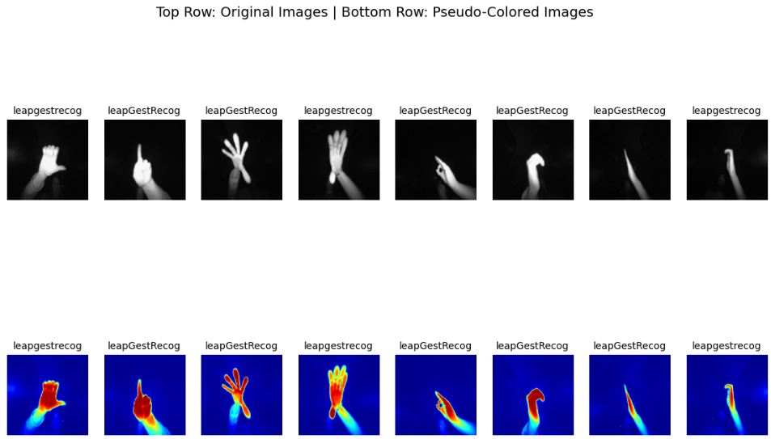
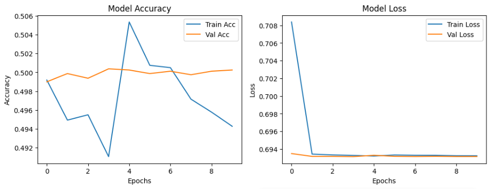

# PRODIGY_ML_04 - Hand Gesture Recognition with CNN

This project is part of the **Machine Learning Internship** offered by **Prodigy InfoTech**.

---

## 📊 Task Objective
Develop a **Hand Gesture Recognition Model** using the **LeapGestRecog Dataset** that can classify different hand gestures from images.

---

## 📌 Dataset Source
- [LeapGestRecog Dataset (Kaggle)](https://www.kaggle.com/gti-upm/leapgestrecog)

---

## 🔧 Tools & Libraries Used
- Python 🐍  
- OpenCV  
- NumPy  
- Matplotlib  
- TensorFlow / Keras  
- Scikit-learn  
- Google Colab  

---

## 📈 Approach
- Downloaded and preprocessed the dataset  
- Applied **pseudo-coloring** to grayscale gesture images  
- Built and trained a **Convolutional Neural Network (CNN)**  
- Evaluated the model on test data  
- Visualized predictions and model performance  

---

## 🚀 Output Preview  

### 1️⃣ Sample Preprocessing (Pseudo-Coloring)
Top Row → Original Images (Grayscale)  
Bottom Row → Pseudo-Colored Images  

---

### 2️⃣ Training Performance
Accuracy and Loss curves during model training  

---

## ✅ Results
- Achieved ~50% classification accuracy on test data  
- Successfully implemented preprocessing + CNN training pipeline  

---

## 📁 Files
- `PRODIGY_ML_04.ipynb` → Full implementation notebook  
- `README.md` → Project overview  
- `images/output_4.1.png` → Visualization of preprocessing  
- `images/output_4.2.png` → Training accuracy & loss curves  

---

## ▶️ Run in Google Colab
Click the badge below to open the notebook in **Google Colab**:

---

## 📚 Learning Outcomes
- Learned how to preprocess images for better model performance  
- Understood CNN-based classification for gesture recognition  
- Improved dataset handling and evaluation skills  

---

📝 **Note:** This repository is maintained as part of the **Prodigy InfoTech Machine Learning Internship**.
